# Modelado y Programación - 2023-1 :joy:
- **Ayudante**: Arturo Lemus Pablo


## UML (Unified Modeling Language)
---
### Estructural

- **Diagrama de clases**: Perspectiva estructural.
<center>
<br/>
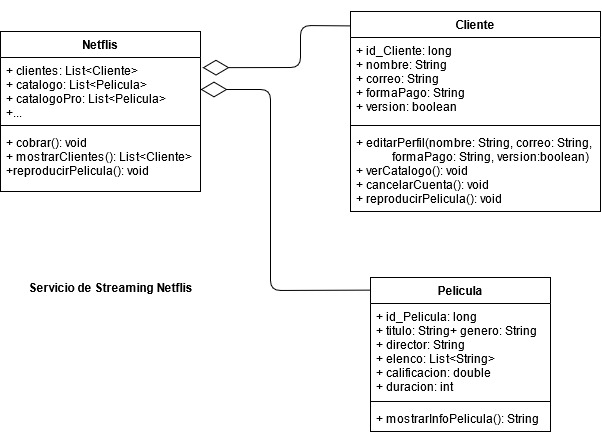
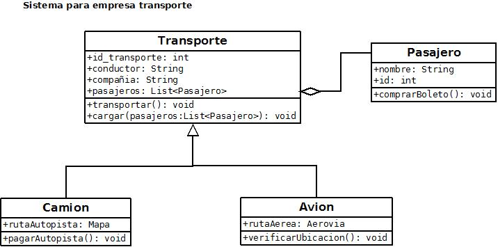
<br/><br/><br/>
</center>

- **Diagrama de casos de uso**: Perspectica de los 
requerimientos que un sistema debe cumplir.
    * **Actores**: Profesor, cliente, sistema, etc.
    * **Casos de uso**: Tareas que se deben realiza ATOMICOS.

<center>
<br/>
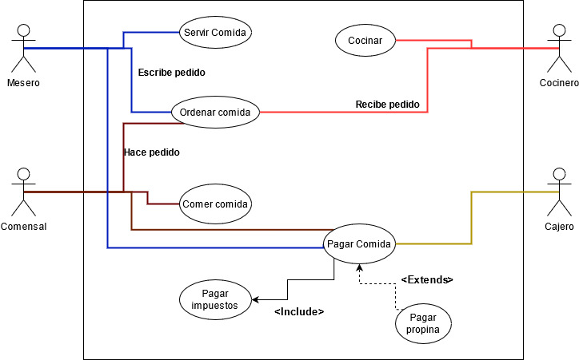
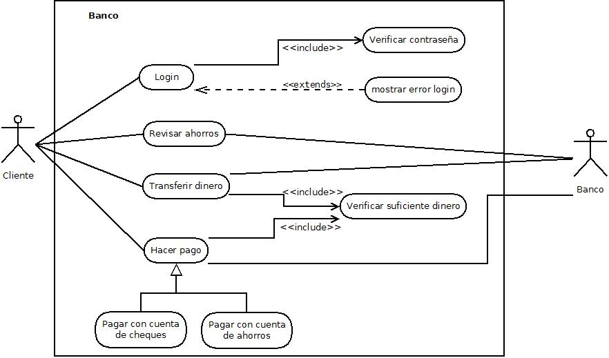
<br/><br/><br/>
</center>


### Dinámica

- **Diagrama de estados**: Perspectiva del comportamiento
dinamico de los objetos (Modela el ciclo de vida de los
objetos de una clase) Solo se enfoca en un objeto a la vez cada diagrama. Como siempre pueden haber precondiciones o postcondiciones entonces eso significa que nos enfocamos en un lapso determinado del ciclo de vida del objeto concreto.

<center>
<br/>
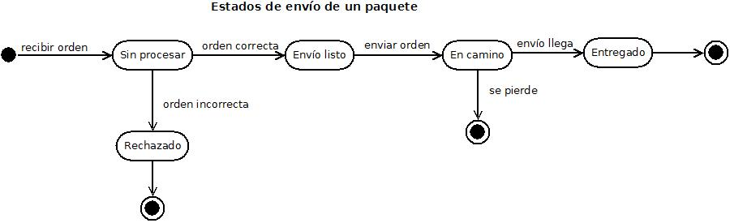
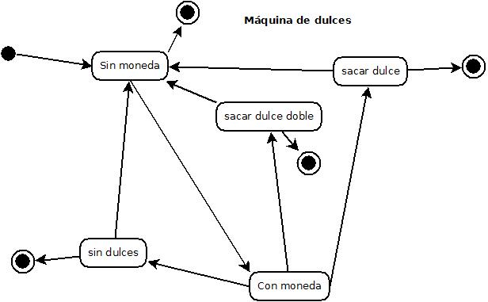
<br/><br/><br/>
</center>

- **Diagrama de actividades**: Perspectiva del flujo de trabajo
de un caso de uso. Cada estado representa el computo de una acción.


<center>
<br/>
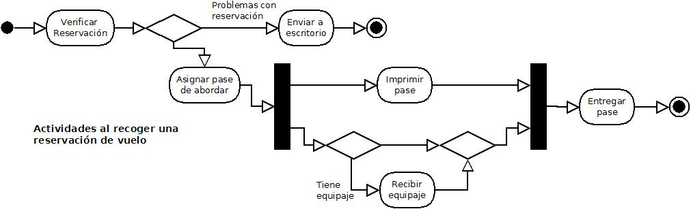

<br/><br/><br/>
</center>

- **Diagrama de secuencia**: Perspectiva de la interacción entre objetos de distintas clases de forma colaborativa a través de actividades. Los objetos tienen un tiempo de vida.


<center>
<br/>
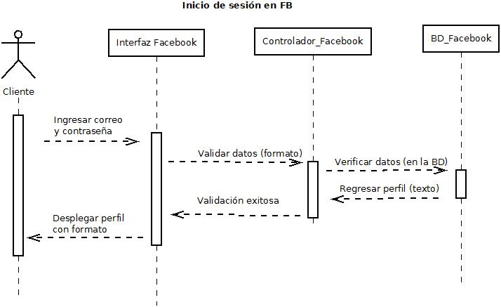
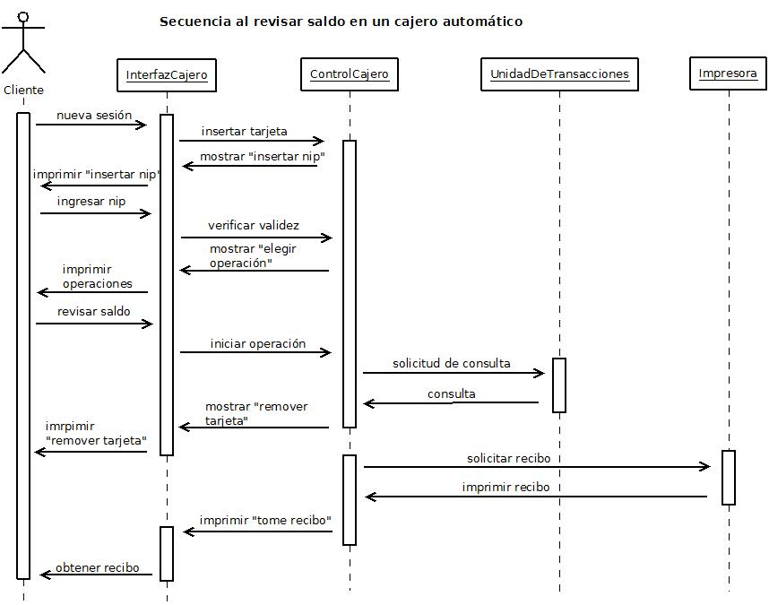
<br/><br/><br/>
</center>


## Patrones de diseño
---

- **Strategy**: Define una familia de algoritmos, encapsula cada uno
y los hace intercambiables. Favorece la composición en lugar de la
herencia, haciendo más flexible la modificación del comportamiento. 

    - **Principio de diseño**: Programar para las interfaces o clases abstractas, en lugar de para implementaciones.

    *Ejemplo*:

<center>
<br/>
    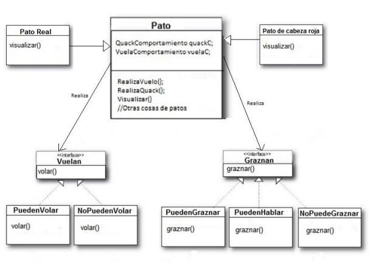
<br/><br/><br/>
</center>

*Ejemplo*:

<center>
<br/>
    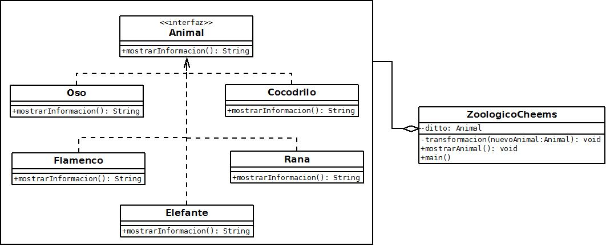
<br/><br/><br/>
</center>


## Git cheatsheet
---

- `git init`: Inicializa un repositorio.
- `git add -A`: Agrega todos los cambios al staging area (antes de enviarlos a internet)
- `git add .`: Agrega los cambios de la carpeta actual solamente al staging area.
- `git commit -m "<message>"`: Haz un commit del staging area como está.
- `git remote add origin <repository_url>`: Agrega el origen remoto de un repositorio.
- `git branch -d <branch_name>`: Elimina una rama.
- `git push`: Enviar los cambios al remoto.
- `git pull`: Obtener los cambios remotos.
- `git checkout <brach_name>`: Cambiar de rama.
- `git diff`: Ver diferencias.
- `git diff <source_branch> <target_branch>`: Ver diferencias entre dos ramas.
- `git diff <branch>`: Diferencia entre version actual y el ultimo commit.
- `git fetch origin`: Eliminar todos los cambios locales
- `git reset --hard origin/master`: **WARNING** Eliminar todos los cambios locales
- `git reset <commit_id>`: Eliminar todos los commits posteriores al commit.


## Herramienta
- Dia (Para modelar UML)
- Draw.io

## Código

`System.out.println("Hello world");`

```java
class Clase extends ParentClass {
    public static void main(String[] args) {
        System.out.println("Hello world");
    }
}

```

```python
class Clase(ParentClass):
    def constructor():
        print("something")

obj = Clase()
```

## Imagenes
<center>

</center>

## Citas

> Un país, una civilización se puede juzgar por la forma en que trata a sus animales.  — Mahatma Gandhi


> Creo que los animales ven en el hombre un ser igual a ellos que ha perdido de forma extraordinariamente peligrosa el sano intelecto animal.
> Es decir, que ven en él al animal irracional, al animal que ríe, al animal que llora, al animal infeliz. — Friedrich Nietzsche

> Esto sería una cita como la que acabas de ver.
> 
> > Dentro de ella puedes anidar otra cita.
> 
> La cita principal llegaría hasta aquí. 