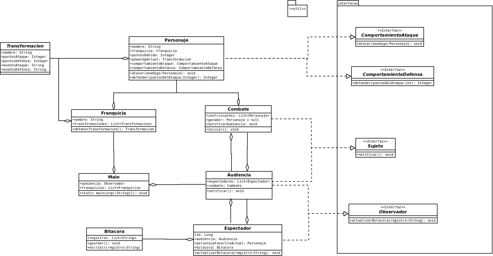

# PRÁCTICA 01 - Modelado y Programación

# Equipo "Better Code Saul"

# Integrantes

| **Nombre**  | **No. de cuenta**  |
|---|---|
|  *Álcantara Estrada Kevin Isaac* |  319073799 |
|  *Cureño Sánchez Misael* |  418002485 |
|  *Hernández Páramo Elizabeth* | 319143209  |

 

# Intrucciones de compilacion

1. Dirigirse al directorio `src` de la práctica.
2. Compilar usando `javac -sourcepath . -d ../target/ ./p01/Main.java`
3. Dirigirse al directorio generado `cd ../target`.
4. Ejecutar usando `java p01.Main`
5. Al finalizar la ejecución se habrá creado la carpeta `./target/bitacoras`
en donde se encuentra cada uno de los ouput de que cada espectador presenció.

 

# SECCIÓN TEÓRICA

**Menciona los principios de diseño esenciales del patrón Strategy y Observer. Menciona una desventaja de cada patrón.**

 

**STRATEGY**
 

    
Como sabemos es un patrón de diseño para el desarrollo del software. Como se nos mencionó en ayudantías, el comportamiento de una clase cambia en tiempo de ejecución, se crean un conjunto de algoritmos representando estartegias para resolver un problema.
    
**Los principios de diseño esenciales de este patrón son:**
    
- **Context** (*Contexto*): Es el elemento que usa los algoritmos.
    
- **Strategy** (*Estrategia*): Se declara una interfaz común para todos los algoritmos soportados.
    
- **Concrete Strategy** (*Estrategia concreta*): Implementa el algoritmo utilizando la interfaz definida por la estrategia.
    
 

**DESVENTAJA:**
    
Una desventaja es que todas las clases de estrategias deben de ser visibles para el cliente, entendiendo cada una de ellas ya que él elige qué clase de estrategia usar, lo que aumenta el costo del cliente hasta cierto punto.

 

---

 

**OBSERVER**

El patrón observer tiene como objetivo avisarnos cuando se realice un cambio sobre el sujeto en el que estamos trabajando. Ya que es un patrón de comportamiento.
    
**Los principios de diseño de este patrón son:**
    
- **Subject** (*Sujeto*): El sujeto crea una interfaz para agregar y eliminar observadores.

- **Observer** (*Observador*): Define el método que usa el sujeto para notificar cambios en su estado.

- **Concrete Subject** (*Sujeto concreto*): Mantiene el estado de interés para los observadores concretos y los notifica cuando cambia su estado.

- **Concrete Observer** (*Observador concreto*): guardan la referencia del objeto que observan, así en caso de ser notificados de algún cambio, pueden preguntar sobre este cambio.

 
    
**DESVENTAJA:**
    
 

Con el uso de este patrón puede ocurrir que se desconozcan las consecuencias de una actualización, ya que dependiendo del problema, puede afectar en mayor o menor medida. Por ejemplo, al rendimiento.

 

# Diagramas

 

    

