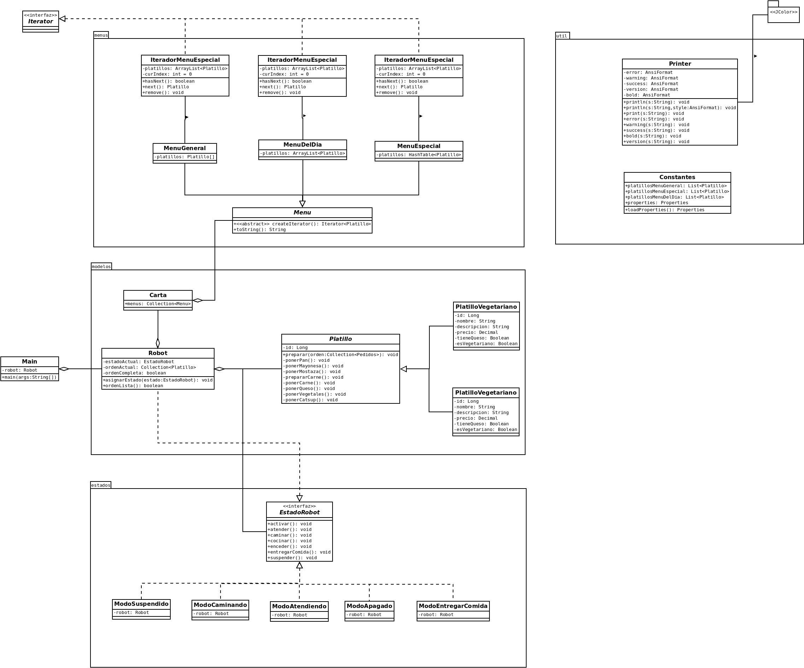
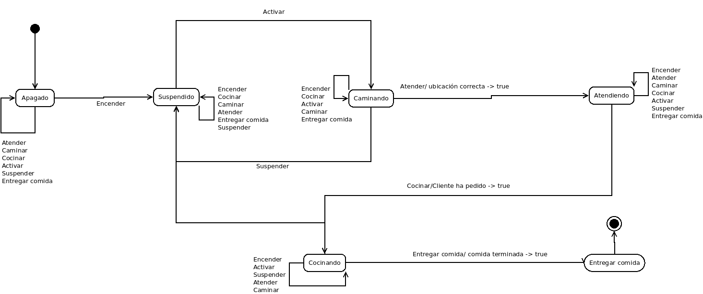

# PRÁCTICA 02 - Modelado y Programación

# Equipo "Better Code Saul"

# Integrantes

| **Nombre**  | **No. de cuenta**  |
|---|---|
|  *Álcantara Estrada Kevin Isaac* |  319073799 |
|  *Cureño Sánchez Misael* |  418002485 |
|  *Hernández Páramo Elizabeth* | 319143209  |

 

# Intrucciones de compilacion

1. Dirigirse al directorio `src` de la práctica.
2. Compilar usando `javac -sourcepath . -d ../target/ -cp .:../lib/* ./p02/Main.java`
3. Dirigirse al directorio generado `cd ../target`.
4. Ejecutar usando `java -cp .:../lib/* p02.Main`.

 

# SECCIÓN TEÓRICA

**Menciona los principios de diseño esenciales del patrón Template, State e Iterator.**

**TEMPLATE**
Como sabemos, el patrón Template es de comportamiento ya que nos ayudan a resolver problemas de interacción entre clases y objetos.
Visto en clase, este patrón define los pasos de un algoritmo y permite que las subclases proporcionen la implementación de uno o más pasos sin cambiar la estructura del algoritmo. Cuenta con pasos abstractos y opcionales, pero también existen los pasos llamados hooks (ganchos), es un paso opcional con un cuerpo vacío.

ESTRUCTURA
•	*Clase abstracta:* Declaran los métodos que actúan como pasos de un algoritmo. Esos pasos pueden declararse abstractos o contar con una implementación por defecto. 
•	*Clases concretas:* Pueden sobrescribir todos los pasos, pero no el propio método por defecto.

**IMPLEMENTACIÓN**
1.	Analizamos el algoritmo para ver si se puede dividir en pasos. Consideramos qué pasos son comunes a todas las subclases y cuáles siempre serán únicos.
2.	Creamos la clase abstracta y declaramos el método plantilla y un grupo de métodos abstractos que representen los pasos del algoritmo.
3.	A algunos pasos les vendría bien tener una implementación por defecto.
4.	Pensamos en añadir hooks entre los pasos del algoritmo.
5.	Para cada variación del algoritmo, creamos una nueva subclase concreta. Debe implementar todos los pasos abstractos, pero también puede sobrescribir algunos de los opcionales.

**DESVENTAJA**
Algunos clientes pueden verse limitados por el esqueleto proporcionado de un algoritmo.

 

**STATE**
Como se vio en clase, el patrón state permite a un objeto alterar su comportamiento cuando su estado interno cambia, el objeto aparenta cambiar su clase. Se usa cuando una clase tiene distintas fases (estados) y en cada una de estas su comportamiento es distinto.

**ESTRUCTURA**
•	*La clase contexto:* Almacena una referencia a uno de los objetos de estado concreto y le delega todo el trabajo específico del estado. El contexto se comunica con el objeto de estado a través de la interfaz de estado. El contexto expone un modificador (setter) para pasarle un nuevo objeto de estado. 
 
•	*La interfaz Estado:* Declara los métodos específicos del estado. Estos métodos deben tener sentido para todos los estados concretos, porque no querrás que uno de tus estados tenga métodos inútiles que nunca son invocados.
 
•	*Estados concretos:* Proporcionan sus propias implementaciones para los métodos específicos del estado. Para evitar la duplicación de código similar a través de varios estados, puedes incluir clases abstractas intermedias que encapsulen algún comportamiento común.

**IMPLEMENTACIÓN**

 

# Diagramas

 

    

    

