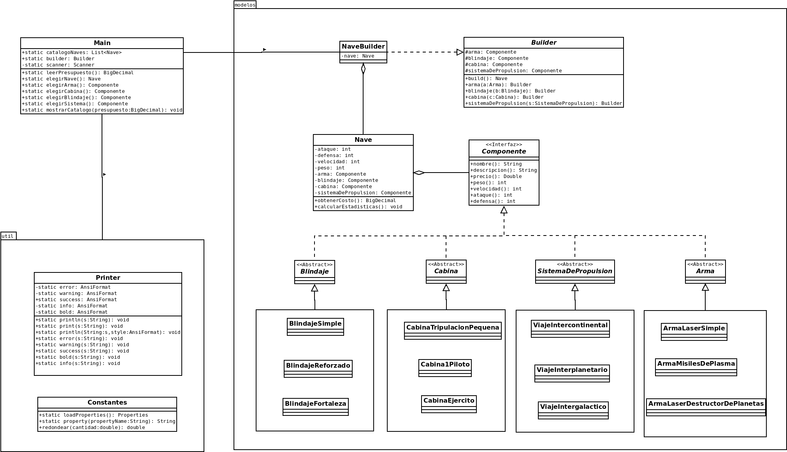

# PRÁCTICA 03 - Modelado y Programación

# Equipo "Better Code Saul"

# Integrantes 

| **Nombre**  | **No. de cuenta**  |
|---|---|
|  *Álcantara Estrada Kevin Isaac* |  319073799 |
|  *Cureño Sánchez Misael* |  418002485 |
|  *Hernández Páramo Elizabeth* |  319143209 |

 

# Instrucciones de compilacion

## Forma 1

1. Dirigirse al directorio `src` de la práctica
2. Compilar usando  

`javac -sourcepath . -d ../target/ -cp .:../lib/* ./main/java/p04/Main.java`

3. Copiar los recursos usando `cp -r ./main/resources ../target/main/`
4. Dirigirse al directorio generado `cd ../target`
5. Ejecutar usando `java -cp .:../lib/* main.java.p04.Main`

## Forma 2 (Linux)
1. Ejecuta el script haciendo `./run.sh` o bien `bash run.sh` desde la terminal, dentro de la carpeta raiz de la práctica (en caso de no tener permiso de ejecución ejecutar `chmod +x run.sh`).

 

# Instrucciones de formato estandarizado
1. En la raíz de la práctica ejecutar `make`.
2. En caso de que solo se quiera saber los errores de formato ejecutar `make check-format`.
3. En caso de que se quieran corregir los errores de formato ejecutar `make reformat`.

 
 
   

# SECCIÓN TEÓRICA

# Diagramas

 

    

