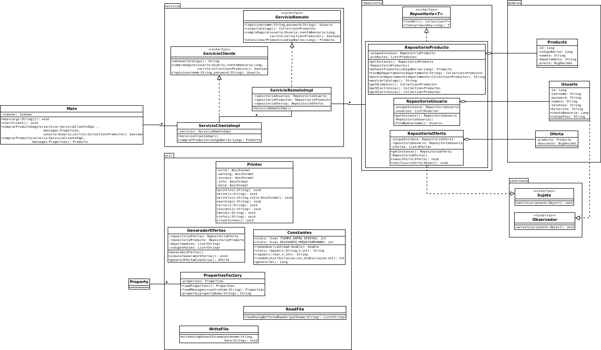
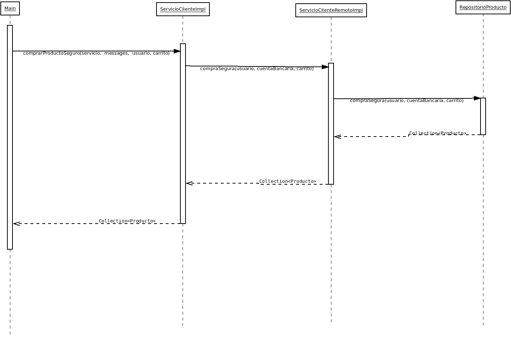

# PROYECTO 01 - Modelado y Programación

# Equipo "Better Code Saul"

# Integrantes 

| **Nombre**  | **No. de cuenta**  |
|---|---|
|  *Álcantara Estrada Kevin Isaac* |  319073799 |
|  *Cureño Sánchez Misael* |  418002485 |
|  *Hernández Páramo Elizabeth* |  319143209 |

 

# Instrucciones de compilacion

## **Linux**

### Forma 1

1. Dirigirse al directorio raiz del proyecto
2. Compilar usando `./mvnw package`
3. Ejecutar usando `java -jar ./target/proyecto_1-0.0.1-executable.jar`

### Forma 2
1. Dirigirse al directorio raiz del proyecto
2. Ejecuta el script haciendo `./run.sh` desde la terminal (en caso de no tener permiso de ejecución ejecutar `chmod +x run.sh`).

 

## **Windows**

### Forma 1

1. Dirigirse al directorio raiz del proyecto
2. Compilar usando `.\mvnw.cmd package`
3. Ejecutar usando `java -jar .\target\proyecto_1-0.0.1-executable.jar`

  

# Notas 
- Los diagramas se encuentran ubicados en la carpeta `docs`
- Existen 3 usuarios predeterminados en el sistema, cuyos datos de inicio de sesion son:

    ### Mexico

    **username:** admin  
    **password:** admin  
    **no. cuenta:** 123

     

    ### España

    **username:** manolo  
    **password:** manolo  
    **no. cuenta:** 12

     
    
    ### USA

    **username:** john  
    **password:** john  
    **no. cuenta:** 1

     

 
 

# Justificación de patrones

- En el caso de los idiomas, decidimos utilizar Factory, pues al ser un patrón que permite que sus subclases decidan qué clase instanciar, nos facilita el poder asignar un idioma. Además de poder incorporar nuevos tipos de productos en el programa sin descomponer el código cliente existente. Teniendo a nuestros métodos abstractos que cambian, sus descendientes implementan a nuestros métodos de la forma que quieran, como lo es en el caso de los idiomas, ya que se requiere que cambien conforme el cliente lo solicite.
 

- En el caso de los catálogos, utilizamos el patrón Proxy debido a que en las instrucciones se nos indicó que no se podía mostrar el cátalogo real, porque si había vulnerabilidad de seguridad, cualquiera podría cambiarlo. Si recordamos lo que vimos en clase, el patrón Proxy proporciona un marcador de posición para otro objeto para controlar el acceso a él, es decir, evitamos que cualquiera lo modifique, en este caso los clientes. 
 

- Para el caso de las ofertas, decidimos utilizar Observer ya que en las instrucciones nos indica que dichas ofertas cambian entre los países, recordando un poco la definición de este patrón, nos dice que se define una dependencia de uno a muchos entre objetos de tal forma que cuando un objeto cambia de estado, todos sus dependientes son notificados y se actualizan autómaticamente. Y es lo que sucede en las ofertas, cuando se indique el país de origen, autómaticamente van a cambiar las ofertas que se le muestren al cliente.
 

- Para salvagualdar la seguridad de los datos del usuario, al solicitar la cuenta bancaria a través de un representante, si los datos son erróneos sacamos al usuario al menu con las opciones de la tienda y puede intentar hacer la compra de nuevo, pues sabemos que pudo haber sido un simple error; sin embargo, si falla de nuevo con los datos, el programa se cierra para evitar que se vulnere la seguridad de los datos del usuario, evitando la posibilidad de hallar la cuenta bancaria asociada mediante la fuerza bruta.
 

# Diagramas

 

    

    

