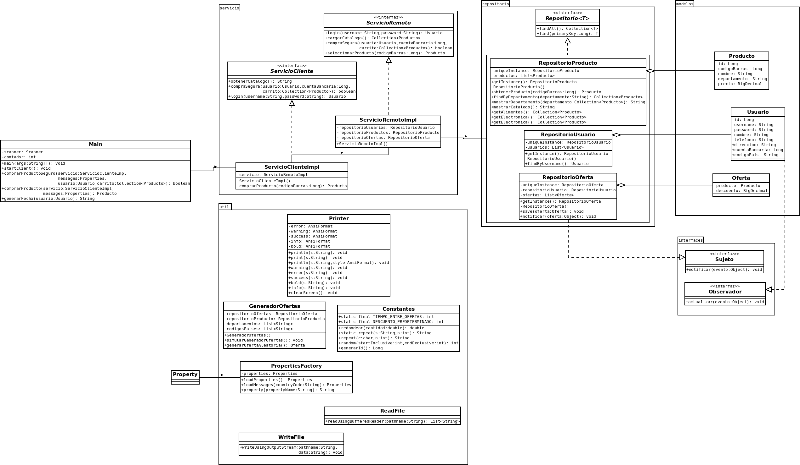

# PROYECTO 01 - Modelado y Programación

# Equipo "Better Code Saul"

# Integrantes 

| **Nombre**  | **No. de cuenta**  |
|---|---|
|  *Álcantara Estrada Kevin Isaac* |  319073799 |
|  *Cureño Sánchez Misael* |  418002485 |
|  *Hernández Páramo Elizabeth* |  319143209 |

 

# Instrucciones de compilacion

## Forma 1 (Linux)

1. Dirigirse al directorio raiz del proyecto
2. Compilar usando `./mvnw package`
3. Ejecutar usando `java -jar ./target/proyecto_1-0.0.1-executable.jar`

## Forma 2 (Windows)

1. Dirigirse al directorio raiz del proyecto
2. Compilar usando `.\mvnw.cmd package`
3. Ejecutar usando `java -jar .\target\proyecto_1-0.0.1-executable.jar`

 
   

# Notas 
- Los diagramas se encuentran ubicados en la carpeta `docs` en la raiz del proyecto.

 
 

# Requerimientos

- Guardar informacion usuarios.
- Generar identificador unico de usuarios.
- Crear Abstract Factory para los mensajes internacionalizados 
(cambiara dependiendo del pais del cliente).
- Lista de productos fija.
- Crear ofertas de manera "aleatoria".
- Personalizar ofertas de manera regional.
- Descuentos fijos establecidos para las ofertas.
- Enviar oferta a usuarios.
- Guardar informacion productos.
- Usar proxy para cargar catalogo de manera remota.
- Dar buen formato a catalogo.
- Iniciar sesion con usuario y contraseña.
- Crear menu usuarios.
- Realizar compra de productos (uno a la vez).
- Mostrar ticket de compra.
- Cerrar sesion.
- Salir del sistema.
- Utilizar representante para compra segura.
- Solicitar numero de cuenta bancaria y compararlo.

# Diagramas

 

    

    

