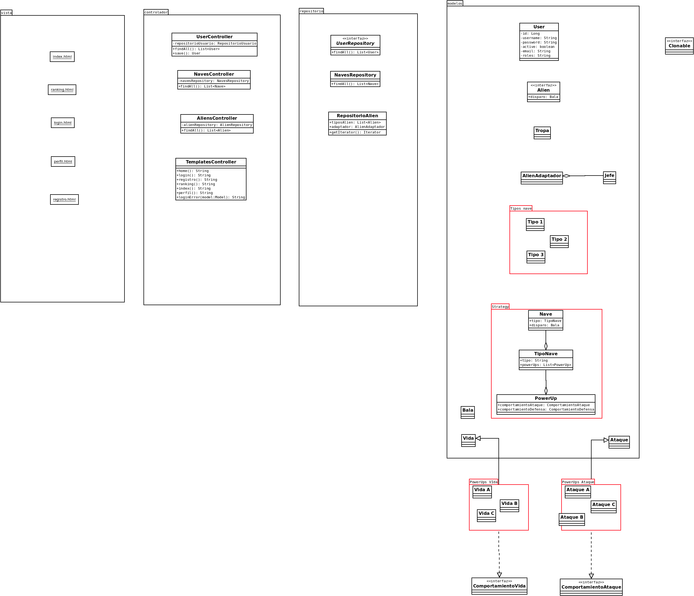

# PROYECTO 01 - Modelado y Programación

# Equipo "Better Code Saul"

# Integrantes 

| **Nombre**  | **No. de cuenta**  |
|---|---|
|  *Álcantara Estrada Kevin Isaac* |  319073799 |
|  *Cureño Sánchez Misael* |  418002485 |
|  *Hernández Páramo Elizabeth* |  319143209 |

 

# Instrucciones de compilacion

## **Linux**

### Forma 1

1. Dirigirse al directorio raiz del proyecto
2. Ejecutar usando `./gradlew bootRun`

 

## **Windows**

### Forma 1

1. Dirigirse al directorio raiz del proyecto
2. Ejecutar usando `.\gradlew.cmd bootRun`

  

# Notas 
- Los diagramas se encuentran ubicados en la carpeta `docs`
- El usuario por defecto es:

    + *Username:* **username**
    + *Password:* **navesespaciales**
    
# Patrones
Para esta práctica utilizamos los siguientes patrones:

1) *Strategy:* Para el desarrollo del proyecto, decidimos utilizar Strategy para implementar a las naves, en el juego puede haber 3 naves, con variaciones de colores para implementarlas, habrá power ups que se comportarán de acuerdo al tipo de nave elegido (Propongo de 2 a 3 power ups por tipo de nave), nos basamos un poco en la práctica 1 para hacer este diseño. Los power up podrian aparecer a los laterales para tomarlos, sin embargo, tambien podemos hacer que de forma aleatoria o al matar cada x enemigos se genere uno y señalar cuando suceda.
 
2) *Prototype:* Recordemos que en este patrón se pueden clonar objetos sin que el código dependa de sus clases, para nuestro juego sucede lo mismo con los enemigos. Para tener una única clase de enemigo y poder tener varias copias de un objeto, podemos hacer que simplemente cambien los colores de los distintos tipos de enemigos. Extiende de la clase Alien
 
3) *Adapter:* Decidimos utilizar Adapter porque podemos tener mini bosses, de tal forma que no sean de la clase Alien pero al usar un adaptador podemos hacer que se comporte como uno. Esto para que si se desea agregar otro tipo de enemigos con otras caracteristicas sea posibles hacerlo sin tocar el codigo de los alines.
 
4) *Iterator:* Podemos tener los tipos de enemigos en una lista privada en un repositorio y que no accedamos directamente a la lista, sino que usemos el patrón de Iterator para que así accedamos a los elementos de la lista y al avanzar oleadas hacemos que el iterador avance para obtener el siguiente tipo de enemigos o minibosses. 
 
5) *MVC:* La parte visual sería lo visto por el usuario, la interfaz del juego.
 
# Notas
 Lo rojo es strategy, el paquete de "Enemigos" implementa Prototype y Adapter, además Prototype se extiende hacia la clase RepositorioAliens y en esta misma se implementaria el patron Iterator
 
 El plan es que en cuanto a MVC los modelos sean las clases que estamos desarrollando junto con los repositorios, el controlador seria el main del proyecto y el visual la interfaz gráfica del juego.
 
 *Aun no esta completo el UML, es un bosquejo y puede ser modificado
 
 **Yo recomendaria no borrar el codigo en js para poder visualizar cómo estaba ordenado el código y volver a él por si algo nos falla o atora.
 
# Cosas por hacer
*Pasar las clases base del main en javaScript a clases de java, serán la base del proyecto, principalmente debemos adaptar las clases Nave, Bala y Alien de acuerdo al Diagrama de clases o de manera similar. De ser posible adaptar sus métodos también.

*Cambiar los colores de las balas, naves y enemigos un poco para así notar diferencia entre los tipos.

*Completar UML

# Diagramas

 

    

    

