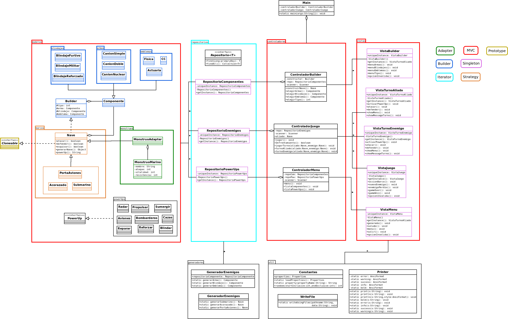

# PROYECTO 01 - Modelado y Programación

# Equipo "Better Code Saul"

# Integrantes 

| **Nombre**  | **No. de cuenta**  |
|---|---|
|  *Álcantara Estrada Kevin Isaac* |  319073799 |
|  *Cureño Sánchez Misael* |  418002485 |
|  *Hernández Páramo Elizabeth* |  319143209 |

 

# Instrucciones de compilacion

## **Linux**

### Forma 1

1. Dirigirse al directorio raiz del proyecto
2. Compilar usando `./mvnw package`
3. Ejecutar usando `java -jar ./target/proyecto_1-0.0.1-executable.jar`

### Forma 2
1. Dirigirse al directorio raiz del proyecto
2. Ejecuta el script haciendo `./run.sh` desde la terminal (en caso de no tener permiso de ejecución ejecutar `chmod +x run.sh`).

 

## **Windows**

### Forma 1

1. Dirigirse al directorio raiz del proyecto
2. Compilar usando `.\mvnw.cmd package`
3. Ejecutar usando `java -jar .\target\proyecto_1-0.0.1-executable.jar`

  

# Patrones
Para esta práctica utilizamos los siguientes patrones:

1) *Strategy:* Para el desarrollo del proyecto, decidimos utilizar Strategy para implementar a los barcos, en el juego puede haber 3 tipos de barcos, habrá power ups que se implementarán de acuerdo al tipo de barco elegido (Propongo de 2 a 3 power ups por tipo de nave) Los power up podrian aparecer cada x turnos
 
2) *Prototype:* Recordemos que en este patrón se pueden clonar objetos sin que el código dependa de sus clases, para nuestro juego sucede lo mismo con los enemigos. Para tener una única clase de enemigo y poder tener varias copias de un objeto, podemos hacer que simplemente cambien losatributos de los distintos tipos de enemigos. Implementa la interfaz barco
 
3) *Adapter:* Decidimos utilizar Adapter porque podemos meter otro tipo de enemigos, de tal forma que no sean de la clase Nave pero al usar un adaptador podemos hacer que se comporte como uno. Esto para que si se desea agregar otro tipo de enemigos con otras caracteristicas sea posibles hacerlo sin tocar el codigo de las Naves.
 
4) *Iterator:* Podemos tener los tipos de enemigos en una lista privada en un repositorio y que no accedamos directamente a la lista, sino que usemos el patrón de Iterator para que así accedamos a los elementos de la lista y al avanzar oleadas hacemos que el iterador avance para obtener el siguiente tipo de enemigos o minibosses. (FALTA CORREGIR PARA PODER IMPLEMENTAR)

5) *Builder:* El usuario arma su tipo de barco al inicio, por ello usamos el patrón
 
6) *MVC:* La parte visual sería lo visto por el usuario, la interfaz del juego.
 
# Notas
 
 El plan es que en cuanto a MVC los modelos sean las clases que estamos desarrollando junto con los repositorios, el controlador seria el main del proyecto compuesto de clases controladoras para no tener mucho cosigo cargado en una sola clase. Lo visual seria la terminal
 
 *Aun no esta completo el UML, es un bosquejo y puede ser modificado
 

 
# Cosas por hacer
*Actualizar el doc application.properties segun las necesidades de nuestro proyecto

*Arreglar bug en el metodo enfrentamiento() de la clase ControladorJUego, pues cuando el enemigo se queda sin vida, seguimos jugando
*Documentar

*Completar UML

# Diagramas

 

    

